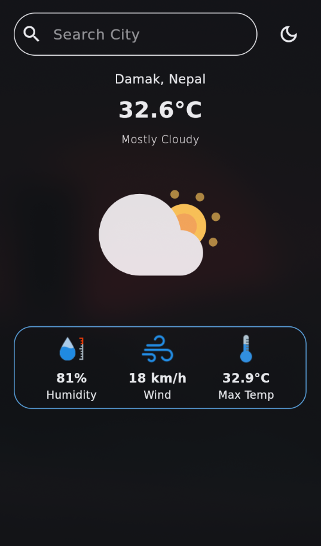

# Weather App 🌦️

[](https://flutter.dev/)
[](https://dart.dev/)
[](#)

A simple **cross-platform weather app** built with **Flutter**.  
This project is meant as a **starter scaffold** for learning Flutter while experimenting with weather APIs and building responsive UIs.

---
## ✨ Features(Planned)

- 🚀 Cross-platform: **Android**, **iOS**, **Web**, **Windows**, **macOS**, **Linux**
- 🏗️ Flutter project structure ready to extend
- 🔧 Easy to integrate with any Weather API (e.g., [OpenWeatherMap](https://openweathermap.org/))

---

## 📸 Preview

<p align="center">
  
</p>


---


## 🛠️ Getting Started

### Prerequisites
Make sure you have:
- [Flutter SDK](https://docs.flutter.dev/get-started/install) installed  
- A code editor (VS Code / Android Studio)  
- Device setup for your target platform(s)  

### Installation
1. **Clone the repo**
   ```bash
   git clone https://github.com/Anush980/weather-app.git
   cd weather-app
   ```
2. **Get Dependencies**
```bash
flutter pub get
```
3. **Run the App**
```bash
flutter run
```

# 📂 Project Structure
```bash
weather-app/
├── android/       # Android native files
├── ios/           # iOS native files
├── lib/           # Main Flutter/Dart source code
├── web/           # Web support
├── linux/         # Linux desktop support
├── macos/         # macOS desktop support
├── windows/       # Windows desktop support
├── test/          # Unit/widget tests
├── pubspec.yaml   # Dependencies & configs
└── README.md
weather-app/
├── android/       # Android native files
├── ios/           # iOS native files
├── lib/           # Main Flutter/Dart source code
├── web/           # Web support
├── linux/         # Linux desktop support
├── macos/         # macOS desktop support
├── windows/       # Windows desktop support
├── test/          # Unit/widget tests
├── pubspec.yaml   # Dependencies & configs
└── README.md

```
---
## 🤝 Contributing

1. Fork the project

2. Create your feature branch
```bash
git checkout -b feature/awesome-feature
```
3. Commit your changes
```bash
git commit -m "Add awesome features"
```
4. Push to your branch and open a PR
